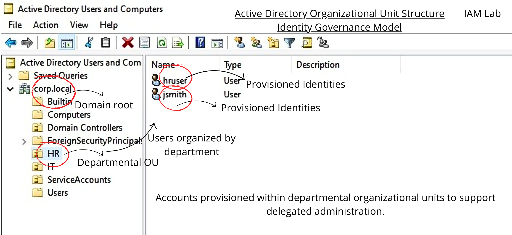
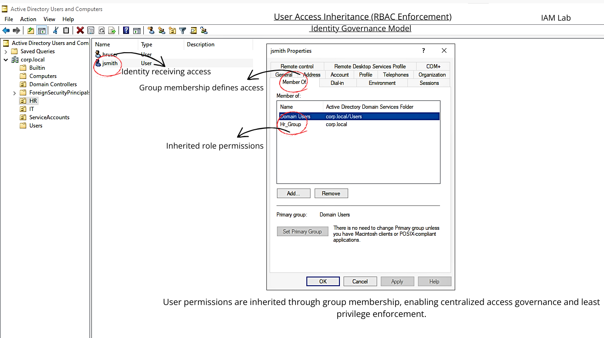

# IAM Lab – Active Directory RBAC & Identity Governance (Hands-On)

This repository documents a hands-on Identity & Access Management (IAM) lab focused on **Active Directory identity structure** and **role-based access control (RBAC)** using **security groups**.

The goal was to simulate how real organizations structure identities and manage access **at scale** using governance-friendly patterns (groups, delegation, and access inheritance).

---
## Skills Demonstrated (What This Lab Proves)
- Active Directory identity modeling (OUs, users, groups)
- RBAC design: assigning access via security groups (not individual users)
- Governance mindset: least privilege + scalable access management
- Audit-friendly verification: validating access inheritance via “Member Of”

## Tools & Environment
- VirtualBox (hosted lab)
- Windows Server 2022 (Domain Controller)
- Active Directory Users and Computers (ADUC)

## Lab Design (Quick Architecture)
**Identity structure:** `corp.local` → departmental OUs (HR / IT / ServiceAccounts / Users)  
**Access model:** users → security groups aligned to roles → access inherited through membership

## What I Built (Lab Summary)

### ✅ Identity Structure (Active Directory)
- Created an on-prem AD domain (`corp.local`)
- Organized identities using **Organizational Units (OUs)**:
  - HR
  - IT
  - ServiceAccounts
  - Users
- Provisioned demo users:
  - `jsmith`, `hruser`, `itadmin`, `serviceacct`

### ✅ RBAC via Security Groups
- Created security groups aligned to role/dept:
  - `HR_Group`
  - `IT_Admins`
  - `Finance_Group`
- Assigned access using **group membership** (not user-by-user permissions)

### ✅ Access Inheritance (Proof of RBAC)
- Verified users inherit role access through the **Member Of** relationship  
  (centralized access management + audit-friendly governance)

---

## Screenshots (Evidence)

---

## Why This Matters (IAM Thinking)

### RBAC (Role-Based Access Control)
Instead of assigning permissions directly to users, access is assigned to **groups aligned to roles**.
This approach supports:
- **Least privilege**
- **Scalability**
- **Auditability**
- **Faster onboarding/offboarding**
- **Cleaner governance**

### Delegation-Friendly Structure
Departmental OUs make it easier to:
- delegate administration to appropriate teams
- apply policies consistently
- maintain clean identity boundaries

---

## Key Learnings

- **Structure matters**: OUs make identity administration scalable and organized.
- **Groups are governance**: group-based provisioning reduces complexity and audit risk.
- **Inheritance is the enforcement layer**: the user’s access story is visible and verifiable.

---

## How to Reproduce (High-Level Steps)

1. Install AD DS on Windows Server and promote to Domain Controller
2. Create OUs (HR, IT, ServiceAccounts, Users)
3. Create users aligned to each OU
4. Create security groups aligned to department roles
5. Add users to groups and validate “Member Of” inheritance

---

## Roadmap (Next Enhancements)
- Extend to Microsoft Entra ID (cloud identities)
- Add Conditional Access + MFA enforcement
- Add Access Reviews + PIM (Privileged Identity Management)
- Simulate Joiner/Mover/Leaver lifecycle controls

---

## Contact
If you work in IAM / Identity Security and want to connect, feel free to reach out on LinkedIn.
# iam-lab-rbac-governance
